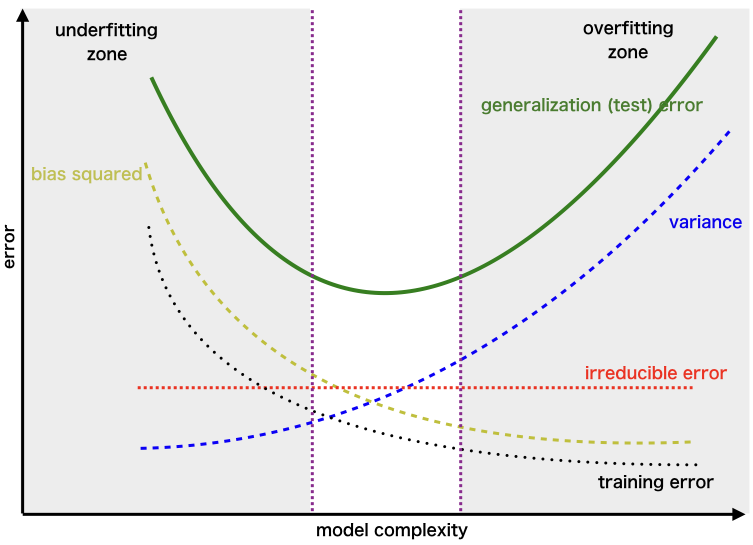

# Deviant Aggressive Behavior

>  "What social policy might be appropriate to reduce deviant aggressive behavior if Theory I were correct? Theory II? Theory III? Theory IV?"

### Theory 1:

Theory 1 makes the claim that deviant aggressive behavior is learned, through some sort of reinforcement system. In other words, an individual learns that deviant aggressive behavior is a dominant strategy for getting what they want, whether that is a stolen candy bar, or land siezed in a violent revolution. Starting from the assumption that this is true, we would observe that deviant aggressive behavior is reduced by implementing a social program that makes deviant aggressive behavior no longer a dominant strategy. I.e. something that decreases the utility of exhibiting deviant aggressive behavior. There are two ways to approach this.

1. Reduce the reward for deviant aggressive behavior
1. Increase the punishment for deviant aggressive behavior.

The first strategy may be something like banks implementing ink-bombs in their money caches, the ink explodes after a heist, and the cash becomes worthless. The second strategy may be something like increasing the prevalence of policing to increase the chance of getting caught, or implementing harsher punishments.

### Theory 2:

Theory 2 makes the claim that deviant aggressive behavior is symbolic of hostility toward personal authority figures. e.g. revolutionaries fight for revolution because their parents are mean to them. A policy which would be appropriate to solve this would have to address this symbolic hostility. I see two approaches. 

1. Mental Health Services could be implemented to help individuals learn to vent their hostility in a non-destructive way.
1. Actions could be taken to reduce hostility toward authority figures. While this is infeasible in the cases of Bosses or Parents, reducing hostility toward public officials is well within the realm of possibility.
  
### Theory 3:

Theory 3 makes the claim that deviant aggressive behavior is the result of people breaking rules that they feel especially affect them. For example, thieves steal things because they feel oppressed by the fact that they have to pay for them. Again, I see two approaches to reducing deviant aggressive behavior under this framework.

1. Reduce the _feeling_ of oppression. This can be split into two subcategories:
  1. Educate people on how a policy or rule actually is fair (see progressive taxes)
  1. Propagandize the oppressed so they don't notice.
1. Reduce oppression. Reform laws that do disproportionately affect certain groups and make them fairer.

### Theory 4:

Theory 4 makes the claim that deviance is a subculture, and individuals are socialized into deviant subculture through contact. For example, thieves steal things because they were inducted into a theiving-culture. There's pretty much only one solution to this kind of deviant aggressive behavior, which is to suppresss deviant aggressive subcultures.

# Waiting Until the Last Minute

> "People often do things at the last minute (students turning in papers, professors grading exams, and so on)."

## a. 
> Ask yourself why the observation might be true and write down your explanations.

This might be true because individuals percieve the "now" as more valuable than the future. Economists usually explain this through a time-discount to reward, generally written as $\beta$. However, the cost of procrastination rises as time goes forward, as it induces stress, and reduces the quality of the person's work. 

## b.
> Generalize the explanatory model – that is, induce the most general, abstract model you can produce
that still has the original observation as a consequence.

I believe that the most generalizable version of this is something along the lines of: "Individuals discount utility gained in the future." This is a more general theory of the previous "Individuals see the cost of working in the future as lower than the cost of working now. 

## c.
>  Induce an alternative model that also has the original observation as a consequence.

An alternative model for this could be something like "People don't percieve deadlines as 'real' until they approach." We can generalize this as "People don't percieve events as 'real' until they approach."

## d.
> For each of the two general models produced in (b) and (c), derive two interesting predictions (four
predictions in total). Be sure the logical connection between your model and your predictions is explicitly
stated and that any assumed facts concerning the world are made explicit.

For simplicity we will call the first theory the 'discount theory', and the second theory the 'crystalization theory'. The discount theory has a few interesting consequences, for one, it can be applied to banking, this is a well-known adaptation in the economics world. It's often cited as the reason loans and interest work. Paying back an increased amount of money in the future is preferable to having more money now. This can have implications for anything that involves planning for the future, for example consider job application processes. Filling out a job application has a cost, and an expected reward, if a company has a particularly long job search process (see some large companies who take 2-3 months to respond to an application), people will be less likely to go through the process of applying.

For the crystalization theory, we should see some implications in time management. For example consider the existential crisis. People are much more likely to have an existential crisis as they age. This is because their death becomes 'realer' to them as they approach it. For another example consider something like a first date. The two participants will become more anxious about the date as they approach it in time, based on this theory.

# Selecting and Fitting a Model

## 1.
>For each part, indicate whether we would generally expect the performance of a flexible statistical learning method to be better or worse than an inflexible method. Justify your answer. 

### a.
> The sample size _n_ is extremely large, and the number of predictors _p_ is small.

For this case we should consider that a large sample size is likely to have a lot of noise, which may interfere with a flexible learning model. Combined with the low number of predictors, this could lead to a situation where the model is needlessly unparsimonius.

### b.
> The number of predictors _p_ is extremely large, and the number of observations _n_ is small.

For this case we would see that an inflexible model will have trouble successfully considering a large number of predictors, especially since some of the prediction dimensions may be better suited for a flexible model than others. For this case, a flexible model would perform better.

### c. 
> The relationship between the predictors and response is highly non-linear.

For this case, we should expect a flexible model to perform better. At high levels of non-linearity it's better to use a model that creates seperate regimes of linearity or low order non-linearity.

### d.
> The variance of the error terms is extremely high.

This indicates that the relationship is more complicated than the model suggests. This means you should probably be using a more flexible model.

## 2. 
>Bias-variance: Think about the graph including bias, variance, training error, test error, and irreducible error curves, moving from less flexible statistical learning methods towards more flexible approaches.

### a. 

The first thing to notice is that the graph is segmented into three regions, the underfitting zone, the overfitting zone, and a 'sweet spot'. Bias and training error are related, so we see that as a model becomes more complex the bias and training error decrease. The learning process is designed to reduce training error as training goes on, so this is not surprising. The irreducable error is flat, and this is really right there in the name, "irreducible". There's nothing the model can do to get rid of it, so we shouldn't see it scale with complexity. Error variance increases over time. In other words, in order to decrease bias, the model will gravitate toward some data points, and further away from other data points. This means that the error will be very low for some points, and very high for others. Because the process minimizes error, it finds that reducing two data points' error by some amount is worth allowing one data point's error to increase. The aggregate of a lot of situations like this leads to the variance climbing. Finally, consider the test error. As the model becomes better and better suited for the training set, it can get into the realm of "overfitting". This is when the system is so 'certain' (for lack of a better word) in the expected value given the training set, that it fails to perform well when given unfamiliar data. 